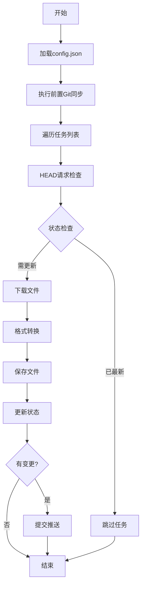

# Rule-Converter 需求文档

| 维度 | 信息 |
| --- | --- |
| **版本编号** | **V0.06 (Configurable Tasks)** |
| **项目名称** | Rule-Converter |
| **主要目标** | 自动化规则抓取、格式转换、多路径分发、全量 Git 同步、网络超时控制及任务结果汇总 |
| **运行环境** | Python 3.10+, Windows 10/11, Git for Windows |

---

## 1. 项目概述

### 1.1 项目背景
Rule-Converter 是一个专门用于自动化处理网络规则文件的转换工具，主要实现从 `.list` 格式到 `.cvc` 格式的转换，并集成了完整的 Git 版本控制功能。

### 1.2 核心价值
- **自动化流程**：减少手动处理规则文件的工作量
- **增量更新**：智能判断文件变更，避免重复处理
- **版本控制**：完整的 Git 集成，确保代码可追溯
- **多任务支持**：支持同时处理多个来源的规则文件

---

## 2. 技术架构

### 2.1 目录结构规范

```
Root Dir (根目录)
├── Project Name (项目名)
│   ├── Sub-Dir 1 (子路径1)
│   │   ├── Gemini.cvc
│   │   ├── Gemini.list
│   │   └── OpenAI.cvc
│   │   └── OpenAI.list
│   ├── CmccBannedList.cvc
│   └── config.json
└── converter/
    ├── RuleConverter.py
    └── 需求说明.txt
```

### 2.2 核心模块设计

| 模块 | 功能 | 文件位置 |
| --- | --- | --- |
| **配置管理** | 加载和保存配置文件 | `load_config()`, `save_config()` |
| **代理管理** | 读取代理配置并生成代理URL | `get_proxy_url()` |
| **Git操作** | 执行Git命令和同步（支持代理+超时） | `run_git_command()` |
| **任务处理** | 规则转换核心逻辑（支持代理下载+超时） | `process_task()` |
| **超时控制** | 为HEAD/GET/Git命令设置独立超时阈值 | `config.json` -> `timeout` |
| **结果汇总** | 统计成功/跳过/失败任务并输出汇总报告 | `main()` |
| **主流程** | 协调各模块执行 | `main()` |

### 2.3 数据流程图



---

## 3. 核心功能规范

### 3.1 Git同步机制

#### 3.1.1 前置同步流程
```python
# 步骤1: Fetch所有远程更新
git fetch --all

# 步骤2: Pull最新文件到本地
git pull origin main
```

**执行时机**：在所有任务处理之前必须执行，确保本地数据源是最新的。

#### 3.1.2 增量更新逻辑
- 使用 `HEAD` 请求获取文件的 `ETag` 或 `Last-Modified` 标识符
- 与 `config.json` 中存储的 `state` 进行对比
- **标识符一致**：跳过任务处理
- **标识符不一致**：执行完整的下载和转换流程

### 3.2 规则转换引擎

#### 3.2.1 格式转换规范 (LIST to CVC)

| 输入格式 | 处理规则 | 输出格式 |
| --- | --- | --- |
| 普通文本 | 删除空行 | 保持原样 |
| `#` 开头注释 | 增加2个空格前缀 | `  #注释内容` |
| `DOMAIN,` 开头 | 提取完整行 | `  - DOMAIN,example.com` |
| `DOMAIN-KEYWORD,` 开头 | 提取完整行 | `  - DOMAIN-KEYWORD,example` |
| `DOMAIN-SUFFIX,` 开头 | 提取完整行 | `  - DOMAIN-SUFFIX,example.com` |
| 其他格式 | 过滤掉 | 不保留 |

#### 3.2.2 处理逻辑详解
```python
# 1. 文件首行必须为 payload:
cvc_output = ["payload:"]

# 2. 处理注释：增加2个空格缩进
if line.startswith('#'):
    cvc_output.append(f"  {line}")

# 3. 过滤有效规则前缀
valid_prefixes = ("DOMAIN,", "DOMAIN-KEYWORD,", "DOMAIN-SUFFIX,")

# 4. 保序去重
if fmt_rule not in seen_rules:
    cvc_output.append(fmt_rule)
    seen_rules.add(fmt_rule)
```

### 3.3 自动化工作流

#### 3.3.1 任务调度机制
支持同时处理多个任务，每个任务独立运行：
1. **Gemini任务**：来源URL → AI子目录 → 备份原始文件
2. **OpenAI任务**：来源URL → AI子目录 → 备份原始文件
3. **CmccBannedList任务**：来源URL → 根目录 → 无备份

#### 3.3.2 提交推送流程
```python
if updated_flag:
    # 更新配置文件状态
    save_config(config_file, config)
    
    # Git操作序列
    git add .
    git commit -m "Auto-update rules @ [时间戳]"
    git push
```

---

## 4. 配置规范

### 4.1 配置文件结构 (`config.json`)

#### 4.1.1 Settings (静态配置)
```json
{
  "settings": {
    "root_dir": "D:\\MyRules",
    "project_name": "CmccBannedList",
    "git_integration": {
      "enabled": true,
      "auto_pull": true,
      "auto_push": true,
      "remote_name": "origin",
      "branch": "main",
      "commit_message": "Auto-update rules"
    },
    "user_agent": "Mozilla/5.0",
    "proxy": {
      "enabled": true,
      "host": "127.0.0.1",
      "port": 6667
    },
    "timeout": {
      "head_request": 10,
      "get_request": 30,
      "git_command": 60
    }
  }
}
```

#### 4.1.2 Tasks (任务清单)
```json
{
  "tasks": [
    {
      "name": "Gemini",
      "source_url": "https://example.com/Gemini.list",
      "sub_dir": "AI",
      "save_list": true
    },
    {
      "name": "CmccBannedList",
      "source_url": "https://example.com/CmccBannedList.list",
      "sub_dir": "",
      "save_list": false
    }
  ]
}
```

| 字段 | 类型 | 必填 | 说明 |
| --- | --- | --- | --- |
| `name` | string | 是 | 任务唯一标识，对应 state 键名 |
| `source_url` | string | 是 | 远程规则文件 URL |
| `sub_dir` | string | 否 | 输出子目录（相对于项目根目录），空字符串表示根目录 |
| `save_list` | boolean | 否 | 是否保存原始 `.list` 文件，默认 `false` |

#### 4.1.3 State (动态状态)
```json
{
  "state": {
    "Gemini": "ETag或时间戳",
    "OpenAI": "ETag或时间戳",
    "CmccBannedList": "ETag或时间戳"
  }
}
```

### 4.2 任务配置

| 任务名称 | 来源URL | 输出子路径 | 备份策略 | 状态管理 |
| --- | --- | --- | --- | --- |
| **Gemini** | `https://raw.githubusercontent.com/Hexon-X/Hex-Clash/refs/heads/main/list/Ai/Gemini.list` | `AI` | 保存原始文件 | 基于ETag |
| **OpenAI** | `https://raw.githubusercontent.com/Hexon-X/Hex-Clash/refs/heads/main/list/Ai/OpenAI.list` | `AI` | 保存原始文件 | 基于ETag |
| **CmccBannedList** | `https://raw.githubusercontent.com/hippowu2021/CmccBannedList/refs/heads/main/CmccBannedList.list` | `""` | 无备份 | 基于ETag |

---

## 5. 实现状态分析

### 5.1 已完成功能清单

#### ✅ 核心功能
- [x] 全量前置Git同步机制
- [x] 增量更新逻辑（HEAD请求+状态对比）
- [x] 完整的格式转换规范（LIST→CVC）
- [x] 保序去重算法
- [x] 自动提交推送流程
- [x] 配置文件管理
- [x] 多任务并发处理

#### ✅ 技术实现
- [x] 路径规范化处理（`os.path.normpath`）
- [x] 错误处理机制
- [x] 用户代理设置
- [x] 命令行参数支持
- [x] 日志输出系统
- [x] 全局代理支持（urllib + Git）
- [x] 网络超时控制（HEAD/GET/Git 独立配置）
- [x] 超时异常分类处理（socket.timeout / URLError）
- [x] 任务列表外置化（config.json tasks 数组）
- [x] 任务结果汇总报告（成功/跳过/失败统计）

### 5.2 待改进项目

#### ⚠️ 需要优化（V0.07）
- [ ] 网络超时自动重试
- [ ] 下载进度与耗时统计

#### 🔄 建议增加（V0.07+）
- [ ] 任务配置外置化（从代码迁移至 config.json）
- [ ] 任务并行化
- [ ] 更多输出格式支持
- [ ] 本地 HTTP 缓存

### 5.3 版本对应关系

| 需求版本 | 实现版本 | 功能匹配度 | 状态 |
| --- | --- | --- | --- |
| V0.06 (Configurable Tasks) | V0.06 (代码中) | 100% | 任务外置+结果汇总+state判空修复 |

---

## 6. 迭代路线图

### 6.1 V0.07 版本规划

#### 新增功能
- **错误处理增强**
  - 网络超时自动重试（可配置次数）
  - 详细错误分类与日志记录
- **进度显示优化**
  - 下载进度百分比
  - 任务耗时统计

### 6.2 V0.08 版本规划

#### 可扩展性设计
- 支持更多输出格式（如 Surge、Clash Meta）
- 自定义规则过滤/转换插件接口

#### 性能优化
- 任务并行化（多线程/异步下载）
- 本地 HTTP 缓存（减少重复 HEAD 请求）

### 6.3 长期目标

#### V0.10 稳定版
- 完整的单元测试覆盖
- 异常恢复机制（中断续传）
- 结构化日志输出（支持日志文件轮转）
- 多仓库/多分支支持

---

## 7. 参考文档

- [Git官方文档](https://git-scm.com/doc)
- [Python urllib文档](https://docs.python.org/3/library/urllib.request.html)
- [JSON配置规范](https://www.json.org/json-en.html)
- [GitHub个人访问令牌](https://docs.github.com/en/authentication/keeping-your-account-and-data-secure/managing-your-personal-access-tokens)

---

*文档最后更新：2026年3月30日*
*维护状态：当前活跃*
